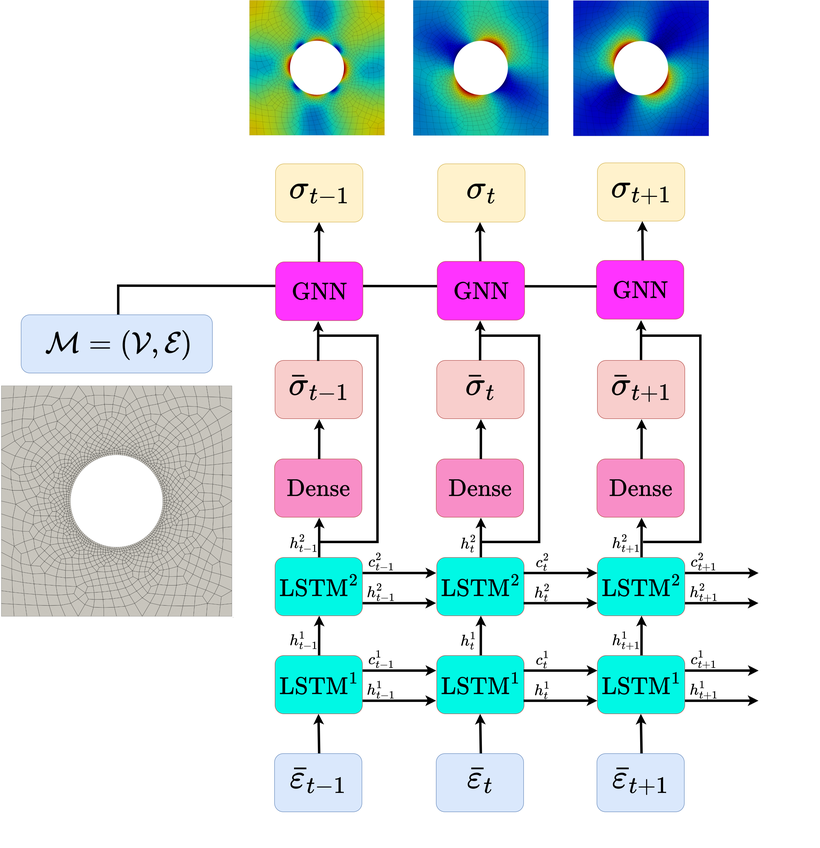
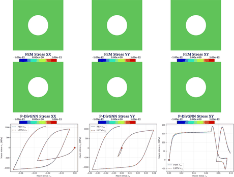
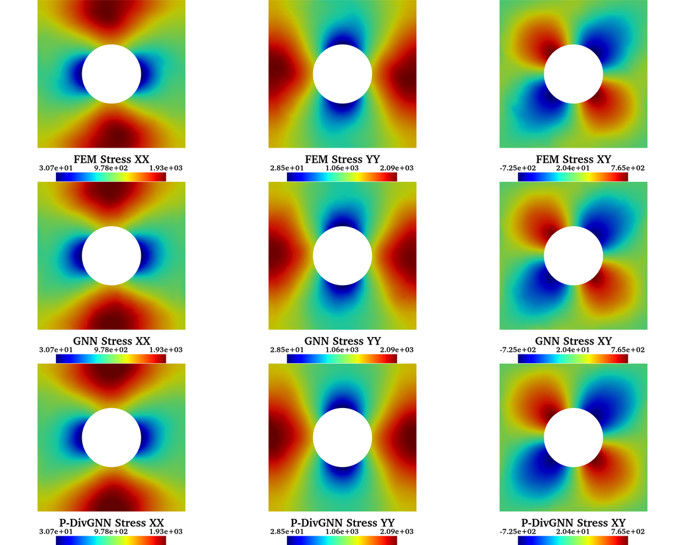
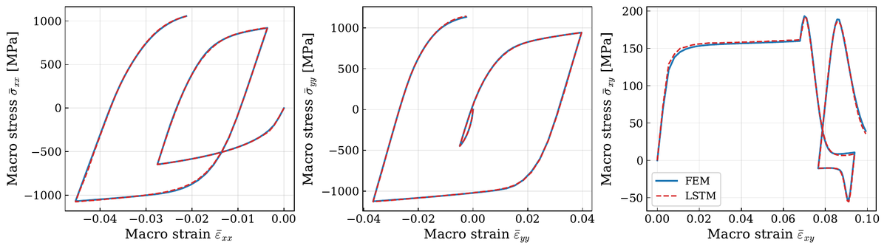
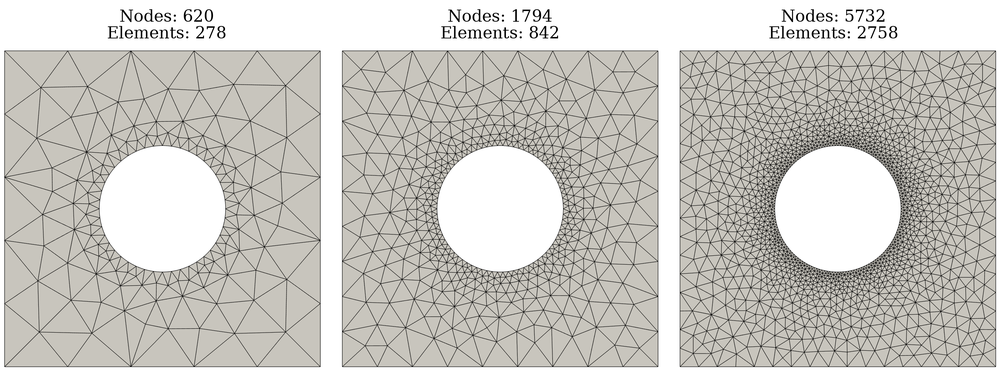
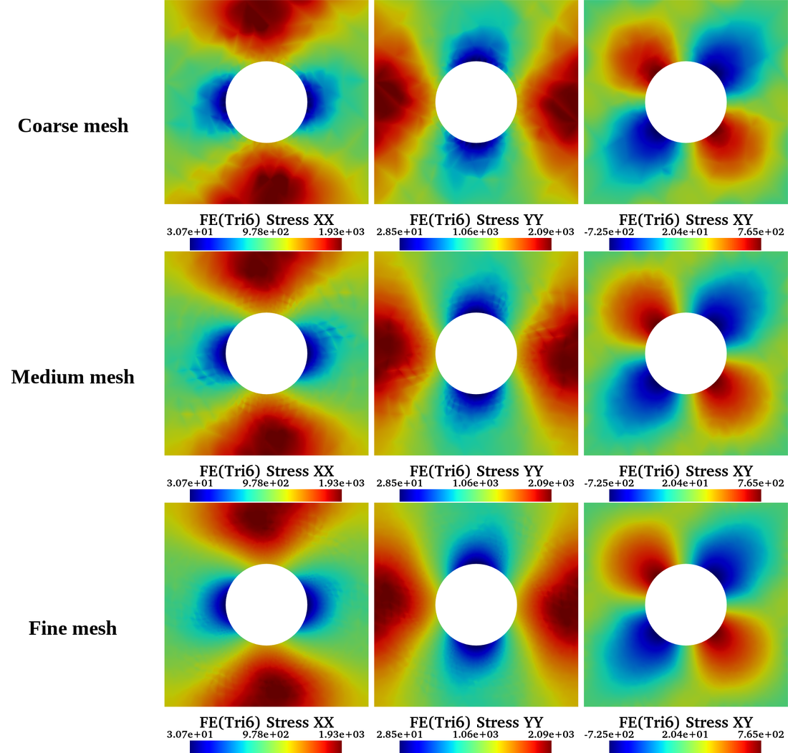
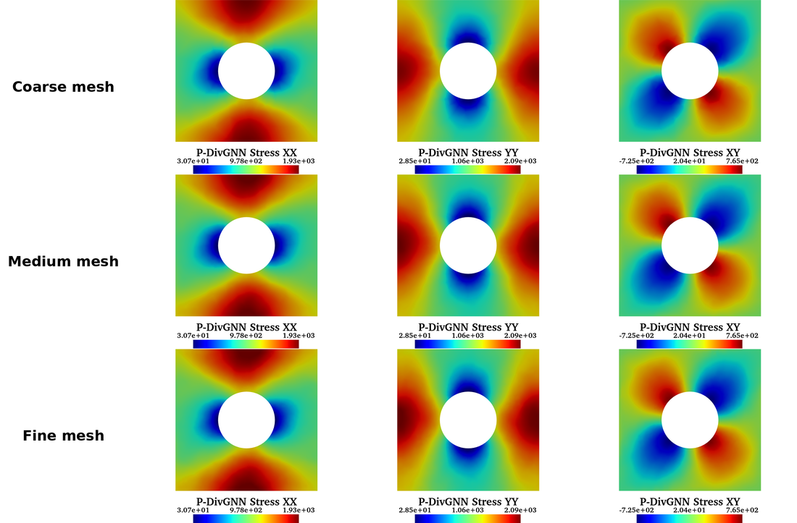
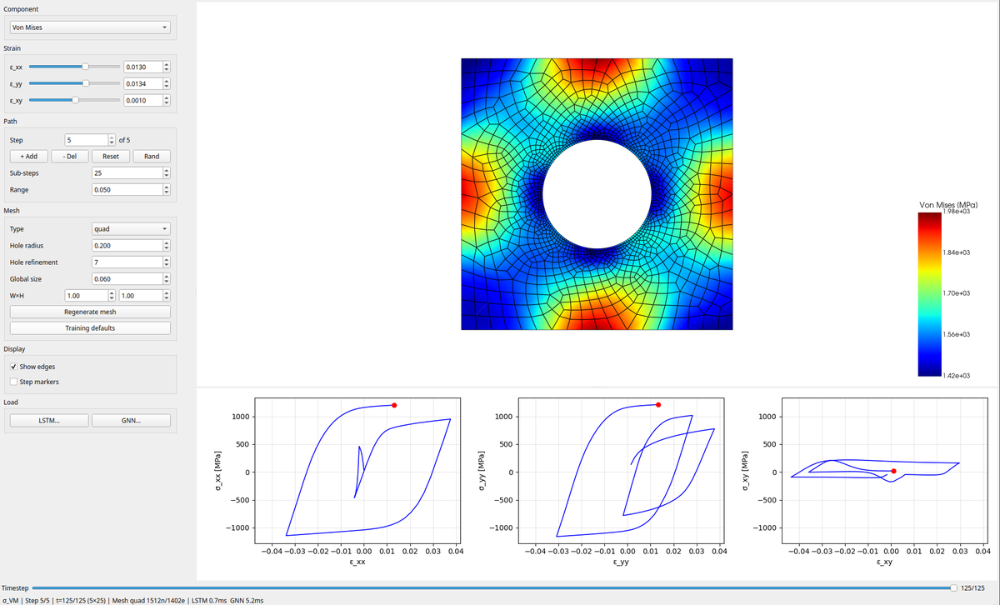

# Non-linear mechanical field reconstruction coupling recurrent neural networks with physics-informed graph neural networks

**Real-time reconstruction of local elasto-plastic stress fields with a coupled
LSTM + graph neural network.**


[](https://ricardo0115.github.io/plastic-pdivgnn/)

> Reproducibility code for the paper
> **Non-linear mechanical field reconstruction coupling recurrent neural networks
> with graph neural networks** *(venue: TBD)*.

A Long Short-Term Memory (LSTM) network encodes the macroscopic strain–stress
history of an elasto-plastic representative unit cell into a hidden state; a
physics-informed Graph Neural Network (GNN) then reconstructs the full **local**
stress field at every load step. The divergence-regularized variant (**P-DivGNN**)
adds a discrete equilibrium penalty that lowers the stress divergence of the
predicted fields.

The repository is **self-contained**: the neural-network models and core utilities
are vendored in the `plgnn` package, alongside the dataset generation, training and
figure scripts — no external project is required. The trained weights are committed
under `weights/`, so every figure reproduces in minutes without retraining or
regenerating the (71 GB) dataset.

<p align="center">
  
</p>

*At each load step the stacked LSTM maps the macroscopic strain history to a macro
stress (Dense head); the GNN then reconstructs the local stress field on the mesh.*

### 🌐 Interactive abstract

Explore the method, the benchmark and a FE ↔ surrogate comparison slider in your
browser: **<https://ricardo0115.github.io/plastic-pdivgnn/>**

<p align="center">
  <a href="https://ricardo0115.github.io/plastic-pdivgnn/">
    
  </a>
</p>

*FE reference (top) vs P-DivGNN prediction (middle) along a non-proportional load
path, with the macroscopic stress-strain curves (bottom). Produced by
`scripts/figures/fig_movie_fem_gnn.py`.*

## Contents

- [Highlights](#highlights)
- [Results](#results)
- [Installation](#installation)
- [Quick start](#quick-start)
- [Repository structure](#repository-structure)
- [Reproducing the figures](#reproducing-the-figures)
- [Interactive viewer](#interactive-viewer)
- [Retraining](#retraining)
- [Dataset](#dataset)
- [Citation](#citation)
- [License](#license)

## Highlights

- **Coupled LSTM → GNN.** The LSTM learns the path-dependent macroscopic
  constitutive response; the GNN spreads it back to a full-field local prediction.
- **Mesh-agnostic.** The GNN runs on quadrilateral, linear-triangle and quadratic
  triangle (tri6) meshes it was never trained on (cross-mesh and mesh-refinement
  studies).
- **Physics-informed.** P-DivGNN penalizes the discrete stress divergence, so the
  reconstructed fields are closer to mechanical equilibrium.
- **Reproducible.** Committed weights + on-the-fly finite-element reference: every
  figure regenerates from a single command, no dataset download required.

## Results

Local stress field at the last load step — finite-element reference vs. GNN vs.
P-DivGNN on the quad mesh:

<p align="center">
  
</p>

Macroscopic response — the LSTM constitutive model vs. the finite-element volume
average along the non-proportional load path:

<p align="center">
  
</p>

Mesh generalization — the quad-trained P-DivGNN run on quadratic-triangle (tri6)
meshes at three refinement levels (the network never saw a triangle in training):

<p align="center">
  
</p>

Finite-element reference (left) and P-DivGNN prediction (right) of the local stress
field on the same coarse / medium / fine tri6 meshes:

<table>
<tr>
<td width="50%"></td>
<td width="50%"></td>
</tr>
</table>

## Installation

```bash
conda env create -f environment.yml
conda activate plastic-lstm-gnn
```

`simcoon` is pulled from the `set3mah` conda channel and is required by the `fedoo`
finite-element solver. The interactive viewer (`scripts/viewers/`) needs the
optional GUI extra:

```bash
pip install -e ".[gui]"   # PyQt5 + pyvistaqt
```

## Quick start

Reproduce the headline figure — the FE / GNN / P-DivGNN local stress field on the
quad mesh — straight from the committed weights:

```bash
python scripts/figures/fig_three_model_compare.py \
  --lstm-checkpoint weights/lstm.pt \
  --gnn-checkpoint weights/gnn.pt \
  --pdivgnn-checkpoint weights/pdivgnn.pt \
  --output-dir outputs/figures
```

Each figure script is a [`fire`](https://github.com/google/python-fire) CLI; solves
the finite-element reference on the fly (fedoo + simcoon) and runs the LSTM-GNN
inference from the committed weights. Run any script with `--help` for all options.

## Repository structure

```
plgnn/                      self-contained package
├── graph/ lstm/ hybrid/    neural-network models (GNN, LSTM, coupled LstmGNN)
├── base.py scaling.py losses.py physics.py physics_fem.py    core utilities
├── datagen.py fem_sim.py   finite-element meshes and solve (fedoo + simcoon)
└── models.py figutils.py movie.py train_utils.py    paper-specific
weights/                    committed reference weights (lstm, gnn, pdivgnn)
mesh/mesh.vtk               committed reference quad mesh (training-default geometry)
scripts/
├── generate_dataset.py     finite-element dataset generation
├── train_lstm.py           train the LSTM constitutive model
├── train_gnn.py            train the GNN / P-DivGNN field reconstructor
├── precompute_hidden_states.py
├── figures/                figure-reproduction scripts (from weights/)
└── viewers/                interactive real-time field viewer (PyQt5; extra: gui)
environment.yml             conda environment (Python 3.12, simcoon, fedoo, ...)
pyproject.toml              dependencies
```

## Reproducing the figures

| Script | Produces |
|---|---|
| `fig_three_model_compare.py` | FE / GNN / P-DivGNN local stress field (quad mesh) |
| `fig_cross_mesh.py` | cross-mesh field (quad vs tri), point evolution, divergence summary |
| `fig_cross_mesh_tri6.py` | tri6 cross-mesh field: FE(Quad)/FE(Tri6)/GNN(Tri6)/P-DivGNN(Tri6) |
| `fig_refinement_grids.py` | tri6 mesh-refinement stress grids (FE / GNN / P-DivGNN) |
| `fig_error_fields.py` | per-node NMSE error maps + stress-divergence-norm maps (quad) |
| `fig_refinement_error.py` | tri6 NMSE error maps (fine-level and coarse→fine vs FE fine) |
| `fig_benchmark.py` | computational benchmark |
| `fig_single_point_lstm.py` | single-point LSTM stress-strain response |
| `fig_arbitrary_8seg.py` | arbitrary 8-segment path + LSTM hidden-state PCA / t-SNE |
| `fig_mesh_quad_tri.py` | quad / tri meshes + FE field (geometry only, no weights) |
| `fig_movie_fem_gnn.py` | animated FE vs P-DivGNN comparison movie |

Outputs are written to `outputs/figures/`. The mesh-refinement
and cross-mesh tri6 figures use **genuine quadratic triangles**: the FE and the GNN
run on the tri6 elements and the fields are rendered with the tri6 shape functions
(curved sides, mid-edge values). `fig_refinement_error.py` additionally interpolates
the coarse-mesh predictions onto the fine mesh to compare them against the fine FE
reference.

<details>
<summary>Run all figures</summary>

```bash
W=weights
OUT=outputs/figures

# local stress field (FE / GNN / P-DivGNN, quad mesh)
python scripts/figures/fig_three_model_compare.py \
  --lstm-checkpoint $W/lstm.pt --gnn-checkpoint $W/gnn.pt \
  --pdivgnn-checkpoint $W/pdivgnn.pt --output-dir $OUT

# cross-mesh (quad vs tri) and tri6 mesh refinement
python scripts/figures/fig_cross_mesh.py \
  --lstm-checkpoint $W/lstm.pt --gnn-checkpoint $W/gnn.pt \
  --pdivgnn-checkpoint $W/pdivgnn.pt --output-dir $OUT
python scripts/figures/fig_cross_mesh_tri6.py \
  --lstm-checkpoint $W/lstm.pt --gnn-checkpoint $W/gnn.pt \
  --pdivgnn-checkpoint $W/pdivgnn.pt --output-dir $OUT
python scripts/figures/fig_refinement_grids.py \
  --lstm-checkpoint $W/lstm.pt --gnn-checkpoint $W/gnn.pt \
  --pdivgnn-checkpoint $W/pdivgnn.pt --output-dir $OUT

# per-node error and divergence maps
python scripts/figures/fig_error_fields.py \
  --lstm-checkpoint $W/lstm.pt --gnn-checkpoint $W/gnn.pt \
  --pdivgnn-checkpoint $W/pdivgnn.pt --output-dir $OUT
python scripts/figures/fig_refinement_error.py \
  --lstm-checkpoint $W/lstm.pt --gnn-checkpoint $W/gnn.pt \
  --pdivgnn-checkpoint $W/pdivgnn.pt --output-dir $OUT

# benchmark and single-point / arbitrary-path LSTM responses
python scripts/figures/fig_benchmark.py \
  --lstm-checkpoint $W/lstm.pt --gnn-checkpoint $W/gnn.pt --output-dir $OUT
python scripts/figures/fig_single_point_lstm.py \
  --lstm-checkpoint $W/lstm.pt --output-dir $OUT
python scripts/figures/fig_arbitrary_8seg.py \
  --lstm-checkpoint $W/lstm.pt --output-dir $OUT

# geometry-only figure (no weights needed)
python scripts/figures/fig_mesh_quad_tri.py --output-dir $OUT
```

</details>

### Comparison movie

```bash
python scripts/figures/fig_movie_fem_gnn.py \
  --lstm_checkpoint weights/lstm.pt --gnn_checkpoint weights/pdivgnn.pt \
  --output_path outputs/fem_gnn_movie.mp4
```

Encodes `.mp4` directly through the bundled `imageio-ffmpeg` binary (no system
`ffmpeg` needed). Each frame stacks the FE field row, the prediction row (sharing
the FE per-frame colorbar), and the macro stress-strain curves with a moving marker.
By default it also writes `<name>_error.mp4` (per-node squared error) and
`<name>_divergence.mp4` (FE / GNN / P-DivGNN `|div(σ)|`); disable with
`--include_error=False` / `--include_divergence=False`.

## Interactive viewer

A PyQt5 application runs the coupled inference live: edit the macroscopic strain
path (per-component sliders, multi-step paths, sub-steps, range), pick the stress
component or von Mises, scrub the load history, and regenerate the mesh (type, hole
radius/refinement, size, dimensions) on the fly. The local stress field is shown in
a pyvista view next to the three macroscopic stress-strain curves.

```bash
python scripts/viewers/realtime_viewer_2d.py \
  --lstm-checkpoint weights/lstm.pt --gnn-checkpoint weights/gnn.pt
```

Requires the `gui` extra (PyQt5 + pyvistaqt).

<p align="center">
  
</p>

## Retraining

Optional and slow (GPU recommended). The committed weights already reproduce every
figure, so this is only needed to train from scratch.

```bash
# 1. Generate the finite-element dataset (one sim_*.npz per sample + mesh.vtk)
python scripts/generate_dataset.py --data-dir <DATA_DIR> --n-samples 10000

# 2. Train the LSTM constitutive model (best checkpoint -> <OUT>/best.pt)
python scripts/train_lstm.py --data-dir <DATA_DIR> --output-dir runs/lstm

# 3. Precompute the LSTM hidden states (GNN node features)
python scripts/precompute_hidden_states.py \
  --data-dir <DATA_DIR> --lstm-checkpoint runs/lstm/best.pt

# 4. Train the GNN, and the P-DivGNN variant (--div-target-ratio > 0)
python scripts/train_gnn.py --data-dir <DATA_DIR> --hidden-dir <DATA_DIR>/hidden \
  --mesh-path <DATA_DIR>/mesh.vtk --output-dir runs/gnn
python scripts/train_gnn.py --data-dir <DATA_DIR> --hidden-dir <DATA_DIR>/hidden \
  --mesh-path <DATA_DIR>/mesh.vtk --output-dir runs/pdivgnn --div-target-ratio 0.1
```

## Dataset

The full finite-element dataset (10,000 non-proportional loading paths, ~71 GB) is
not stored in git. Regenerate it with `scripts/generate_dataset.py`.

## Citation

The paper is under review; citation details will be finalized upon publication.

```bibtex
@article{guevaragarban_plastic_lstm_gnn,
  title   = {Non-linear mechanical field reconstruction coupling recurrent
             neural networks with graph neural networks},
  author  = {Guevara Garban, Manuel Ricardo and others},
  journal = {TBD},
  year    = {2026},
  note    = {Under review}
}
```

This work builds on [PyTorch](https://pytorch.org/),
[PyTorch Geometric](https://pyg.org/), and the
[fedoo](https://github.com/3MAH/fedoo) / [simcoon](https://github.com/3MAH/simcoon)
finite-element stack.

## License

[GPL-3.0-or-later](LICENSE).
